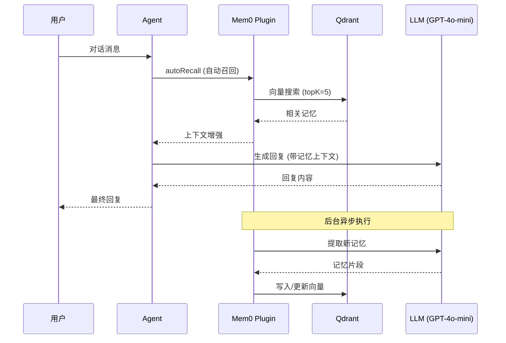

# OpenClaw 记忆系统架构文档

**更新日期：** 2026-03-13
**版本：** 2.0 (Mem0 统一架构)

---

## 1. 架构概览

### 1.1 系统定位

本项目采用 **Mem0 插槽记忆系统** 作为唯一的记忆管理方案，完全替代 OpenClaw 原生的文件型记忆系统。

```
┌─────────────────────────────────────────────────────────┐
│                    OpenClaw Agent                        │
│  (xiaodong, xiaoguan, aduan, xiaodong_crossborder...)   │
└────────────────────┬────────────────────────────────────┘
                     │
        ┌────────────┴────────────┐
        │                         │
   memory_search          knowledge_search
   (Mem0 Plugin)          (Haystack Plugin)
        │                         │
        └────────────┬────────────┘
                     ↓
            Qdrant 向量引擎
            (qdrant.99uwen.com)
                     │
        ┌────────────┴────────────┐
        │                         │
  openclaw_mem0_prod      company-kb-prod
  (对话记忆/偏好)         (企业知识库)
```

### 1.2 核心组件

| 组件 | 职责 | 存储位置 | 工具 |
|------|------|----------|------|
| **Mem0 Plugin** | 自动提取和召回对话记忆 | Qdrant `openclaw_mem0_prod` | `memory_search`, `memory_store`, `memory_forget` |
| **Knowledge Search** | 企业文档/图片检索 | Qdrant `company-kb-prod` | `knowledge_search` |
| **Native Memory** | ❌ 已禁用 | N/A | N/A |

---

## 2. Mem0 记忆系统详解

### 2.1 工作原理



### 2.2 配置参数

**位置：** `instances/kentclaw/data/openclaw.json`

```json
{
  "plugins": {
    "slots": {
      "memory": "openclaw-mem0"
    },
    "entries": {
      "openclaw-mem0": {
        "enabled": true,
        "config": {
          "mode": "open-source",
          "userId": "${MEM0_BASE_USER_ID}",
          "autoRecall": true,
          "autoCapture": true,
          "topK": 5,
          "searchThreshold": 0.5,
          "oss": {
            "embedder": {
              "provider": "openai",
              "config": {
                "apiKey": "${OPENAI_API_KEY}",
                "model": "text-embedding-3-small"
              }
            },
            "vectorStore": {
              "provider": "qdrant",
              "config": {
                "url": "https://qdrant.99uwen.com",
                "apiKey": "${QDRANT_API_KEY}",
                "collectionName": "openclaw_mem0_prod",
                "dimension": 1536
              }
            },
            "llm": {
              "provider": "openai",
              "config": {
                "apiKey": "${OPENAI_API_KEY}",
                "model": "gpt-4o-mini"
              }
            }
          }
        }
      },
      "memory-core": {
        "enabled": false
      }
    }
  }
}
```

### 2.3 环境变量

**位置：** `instances/kentclaw/.env`

```bash
# Qdrant 配置
QDRANT_URL=https://qdrant.99uwen.com
QDRANT_API_KEY=b5f76dd48b706008495b983487aff77a27630e609290bf78550cd79a6384addb

# Mem0 配置
MEM0_BASE_USER_ID=kentclaw
MEM0_QDRANT_COLLECTION=openclaw_mem0_prod
MEM0_HISTORY_DB_PATH=/home/node/.openclaw/state/mem0-history.sqlite
MEM0_EMBEDDER_MODEL=text-embedding-3-small
MEM0_LLM_MODEL=gpt-4o-mini

# OpenAI API
OPENAI_API_KEY=sk-xxx...
```

---

## 3. 记忆数据结构

### 3.1 Qdrant Payload 结构

```json
{
  "userId": "kentclaw",
  "agentId": "xiaodong",
  "memory": "[2026-03-10] 认知系统建设\n\nKent 提出希望让小东帮助记住一些感知与思考...",
  "date": "2026-03-10",
  "category": "认知系统建设",
  "source": "markdown_migration",
  "original_file": "2026-03-10.md",
  "created_at": "2026-03-13T08:30:00.000Z"
}
```

### 3.2 索引字段

Qdrant Collection `openclaw_mem0_prod` 已建立以下 Payload 索引：

```bash
# 索引创建脚本：scripts/ensure_mem0_qdrant_indexes.sh
curl -X PUT "https://qdrant.99uwen.com/collections/openclaw_mem0_prod/index" \
  -H "api-key: ${QDRANT_API_KEY}" \
  -d '{"field_name":"userId","field_schema":"keyword"}'

curl -X PUT "https://qdrant.99uwen.com/collections/openclaw_mem0_prod/index" \
  -H "api-key: ${QDRANT_API_KEY}" \
  -d '{"field_name":"agentId","field_schema":"keyword"}'

curl -X PUT "https://qdrant.99uwen.com/collections/openclaw_mem0_prod/index" \
  -H "api-key: ${QDRANT_API_KEY}" \
  -d '{"field_name":"runId","field_schema":"keyword"}'
```

---

## 4. Agent 使用指南

### 4.1 工具使用

#### `memory_search` - 召回记忆

```typescript
// 自动召回（每次对话开始时）
// Mem0 会自动根据当前对话内容召回相关记忆

// 手动召回
await memory_search({
  query: "上周天气日报的问题是什么",
  limit: 5
});
```

#### `memory_store` - 显式存储

```typescript
// 用户明确要求记住某事时
await memory_store({
  content: "Kent 偏好简洁的回复，不要冗长的总结"
});
```

#### `memory_forget` - 删除记忆

```typescript
// 删除过时或错误的记忆
await memory_forget({
  memory_id: "uuid-xxx"
});
```

### 4.2 AGENTS.md 配置

**所有 Agent 的 AGENTS.md 已更新为：**

```markdown
## Every Session

Before doing anything else:

1. Read `SOUL.md` — this is who you are
2. Read `USER.md` — this is who you're helping

Don't ask permission. Just do it.

## Memory System (Updated 2026-03-13)

**We use Mem0 for all memory management.** Use `memory_search` to recall past context.
```

**移除的内容：**
- ❌ `memory/YYYY-MM-DD.md` 日志文件
- ❌ `MEMORY.md` 长期记忆文件
- ❌ `memory/heartbeat-state.json` 状态追踪

---

## 5. 数据迁移记录

### 5.1 迁移脚本

**位置：** `scripts/migrate-memory-to-mem0.mjs`

**功能：**
1. 读取 `workspace/*/memory/*.md` 文件
2. 按 `## 标题` 切分为独立记忆单元
3. 调用 OpenAI Embedding API 生成向量
4. 直接写入 Qdrant（绕过 Mem0 SDK 的 SQLite 依赖）

**执行：**
```bash
set -a && source instances/kentclaw/.env && set +a
node scripts/migrate-memory-to-mem0.mjs
```

### 5.2 迁移结果

| Agent | 导入 | 跳过 | 说明 |
|-------|------|------|------|
| xiaodong | 11 | 2 | 天气优化、认知系统、任务记录等 |
| xiaoguan | 0 | 1 | 文件内容太短 |
| aduan | 0 | 0 | 无 memory 文件 |
| **总计** | **11** | **3** | |

---

## 6. 测试与验证

### 6.1 健康检查

```bash
# 1. 检查 OpenClaw 状态
curl http://127.0.0.1:18801/healthz
# 预期：{"ok":true,"status":"live"}

# 2. 检查 Qdrant Collection
curl -H "api-key: ${QDRANT_API_KEY}" \
  https://qdrant.99uwen.com/collections/openclaw_mem0_prod
# 预期：返回 collection 信息，vectors_count > 0

# 3. 检查 Mem0 插件加载
docker logs openclaw-kentclaw | grep "openclaw-mem0"
# 预期：看到 "openclaw-mem0: registered"
```

### 6.2 功能测试

**测试用例 1：记忆召回**
```
用户：上周天气日报出了什么问题？
预期：Agent 能召回 2026-03-10 的"天气日报兜底检查"记忆
```

**测试用例 2：自动捕获**
```
用户：记住，我喜欢简洁的回复，不要冗长的总结
预期：Mem0 自动提取并存储这个偏好
```

**测试用例 3：跨 Agent 记忆**
```
在 xiaodong 对话：Kent 说他在做跨境电商
切换到 xiaoguan 对话：你知道 Kent 在做什么吗？
预期：xiaoguan 能召回 Kent 的业务信息（userId=kentclaw 共享）
```

### 6.3 性能监控

```bash
# 查看 Qdrant 存储大小
curl -H "api-key: ${QDRANT_API_KEY}" \
  https://qdrant.99uwen.com/collections/openclaw_mem0_prod | jq '.result.vectors_count'

# 查看 Mem0 历史数据库大小
ls -lh instances/kentclaw/data/state/mem0-history.sqlite
```

---

## 7. 故障排查

### 7.1 常见问题

**问题 1：记忆召回为空**
```bash
# 检查 Qdrant 连接
curl -H "api-key: ${QDRANT_API_KEY}" \
  https://qdrant.99uwen.com/collections/openclaw_mem0_prod/points/scroll

# 检查 userId 是否匹配
echo $MEM0_BASE_USER_ID  # 应该是 kentclaw
```

**问题 2：Mem0 插件未加载**
```bash
# 检查配置
cat instances/kentclaw/data/openclaw.json | jq '.plugins.slots.memory'
# 应该返回 "openclaw-mem0"

# 检查插件文件
ls -la instances/kentclaw/data/extensions/openclaw-mem0/
```

**问题 3：OpenAI API 限流**
```bash
# 检查 API 调用频率
docker logs openclaw-kentclaw | grep "429"

# 调整 autoCapture 频率（如需要）
# 在 openclaw.json 中添加：
# "captureThrottle": 5000  // 5秒内最多捕获一次
```

### 7.2 回滚方案

如果需要回滚到原生记忆系统：

```bash
# 1. 恢复配置
cd instances/kentclaw/data
cp openclaw.json.bak openclaw.json  # 如果有备份

# 2. 启用 memory-core
# 编辑 openclaw.json:
# "memory-core": { "enabled": true }
# "slots": { "memory": "memory-core" }

# 3. 恢复 memory 文件
cp -r workspace/xiaodong/backups/manual-20260311-102440/memory \
     workspace/xiaodong/

# 4. 恢复 AGENTS.md
for agent in xiaodong xiaoguan aduan; do
  cp workspace/${agent}/AGENTS.md.bak workspace/${agent}/AGENTS.md
done

# 5. 重启
docker restart openclaw-kentclaw
```

---

## 8. 最佳实践

### 8.1 记忆管理原则

1. **信任自动捕获** - Mem0 会自动提取重要信息，无需手动 `memory_store`
2. **定期清理** - 每 3-6 个月检查并删除过时记忆
3. **避免重复** - Mem0 有去重机制，但仍需注意不要重复存储相同信息
4. **隐私保护** - 敏感信息（密码、API Key）不应存入记忆

### 8.2 性能优化

1. **控制 topK** - 默认 5 条，过多会增加 token 消耗
2. **调整阈值** - `searchThreshold: 0.5`，低于此相似度的记忆不召回
3. **监控成本** - Embedding API 调用会产生费用，关注 OpenAI 账单

### 8.3 数据备份

```bash
# 定期备份 Qdrant collection
curl -X POST -H "api-key: ${QDRANT_API_KEY}" \
  https://qdrant.99uwen.com/collections/openclaw_mem0_prod/snapshots

# 备份 Mem0 历史数据库
cp instances/kentclaw/data/state/mem0-history.sqlite \
   backups/mem0-history-$(date +%Y%m%d).sqlite
```

---

## 9. 参考资料

- [OpenClaw 官方文档](https://docs.openclaw.ai)
- [Mem0 OSS 文档](https://docs.mem0.ai)
- [Qdrant 文档](https://qdrant.tech/documentation/)
- [迁移总结](../MEMORY_MIGRATION_SUMMARY.md)
- [架构设计](./openclaw_knowledge_architecture.md)

---

**维护者：** Kent
**最后更新：** 2026-03-13
