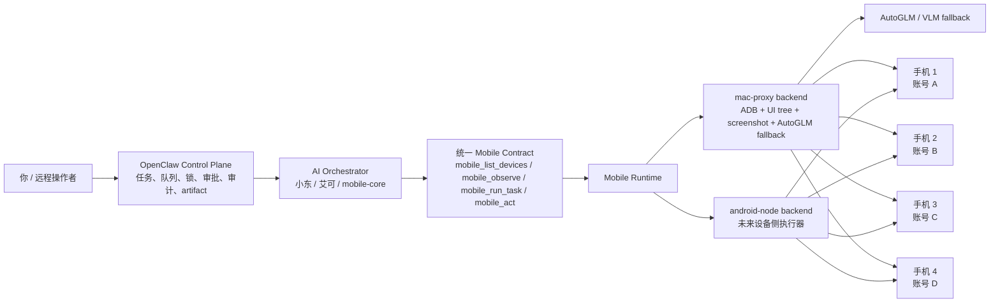
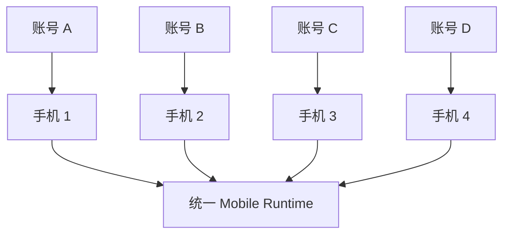
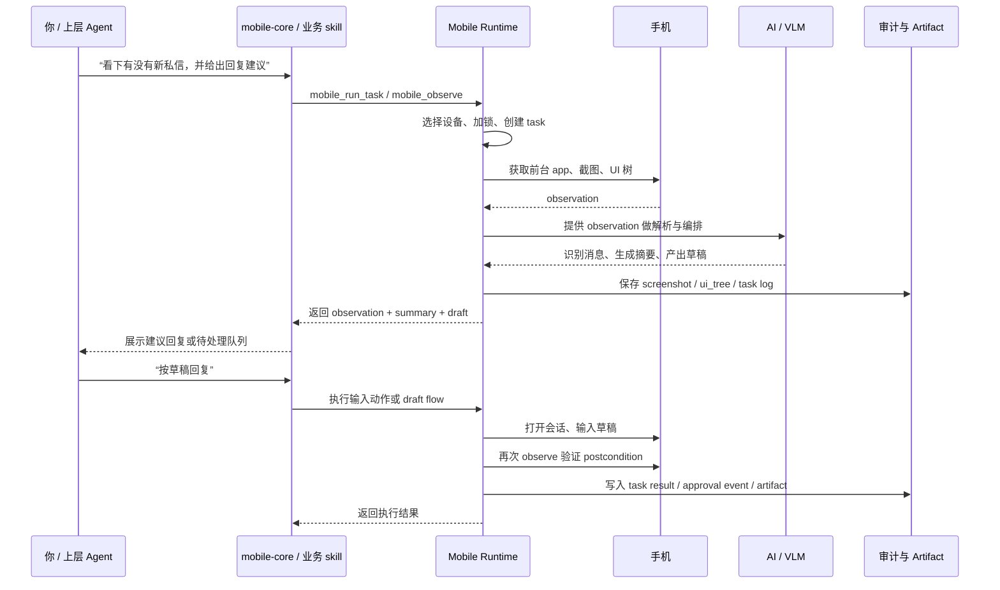
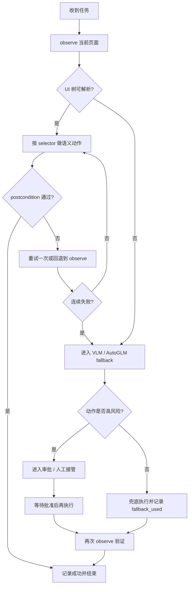
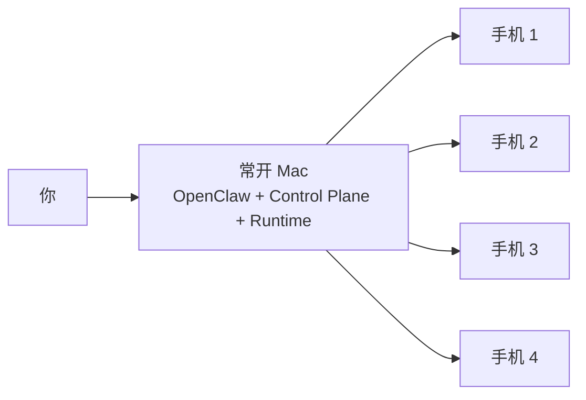
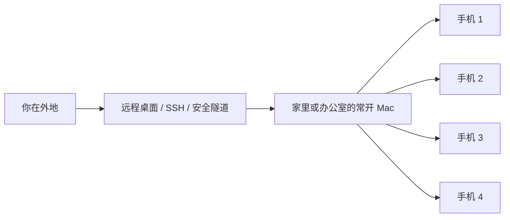
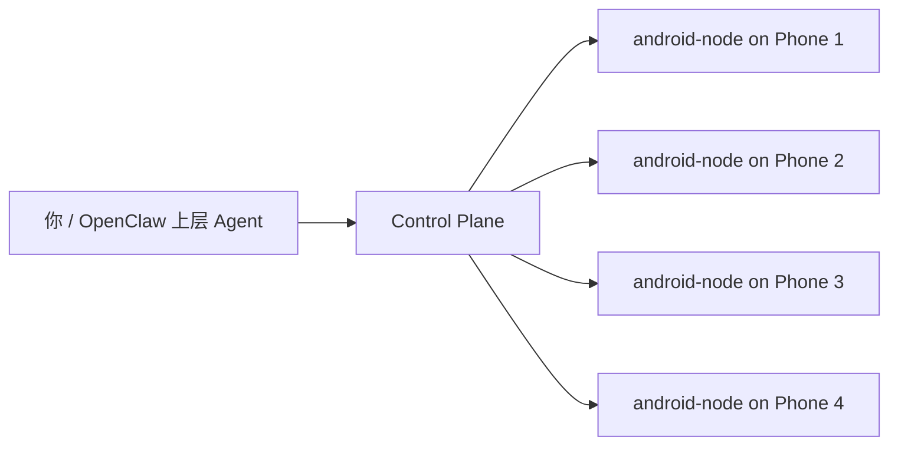

# Mobile Account Ops Architecture

## 1. 文档目的

这份文档回答 4 个问题：

1. 为什么 4 台手机不该只是“群控设备”，而应该被设计成 4 个稳定业务终端。
2. OpenClaw、AI、手机 runtime、AutoGLM 分别承担什么角色。
3. 这套系统在本地值守和外地远程两种场景下，分别怎么运行。
4. 为什么推荐“安全优先的半自动化”，而不是直接做高风险的全自动账号操作。

这不是一份“手机自动点击说明书”，而是一份面向技术负责人、产品负责人和后续实现者的架构说明。

## 2. 目标与边界

### 2.1 目标

- 用 4 台 Android 手机承载 4 组真实账号。
- 用 AI 帮助完成观察、整理、分类、草稿生成、提醒、远程接管。
- 让你在本地和外地都能管理这些账号，不必随身带着 4 台手机。
- 让系统逐步演进为 OpenClaw 的正式 `mobile runtime + mobile skills` 能力。

### 2.2 非目标

- 不把系统设计成批量刷互动、批量导流、批量评论、批量发布的黑盒群控器。
- 不把 `exec adb ...` 继续暴露给业务 Agent。
- 不把 AutoGLM 当成唯一主路径。
- V1 不深做 iOS，只保留接口扩展位。

### 2.3 设计原则

- 设备是真实身份终端，不是一次性工具。
- AI 负责理解、编排、建议，不负责无约束乱点。
- 默认先观察，再行动，再验证。
- 能用结构化语义操作就不用坐标点击。
- 高风险动作必须审批或人工接管。
- 当前先把控制面稳定下来，再把设备逐步节点化。

## 3. 目标架构总览

### 3.1 一句话解释

- `Control Plane` 是大脑和中台。
- `Mobile Runtime` 是统一执行层。
- 4 台手机是账号终端和业务现场。
- AutoGLM 是兜底执行器，不是总控。

## 4. 为什么必须分层

如果把“手机能力”做成一个大 skill，后面会出现 4 个问题：

- 业务 skill 会直接依赖 ADB、坐标、序列号，后期无法收敛。
- 设备锁、队列、审批、审计会散落在各个 Agent 里。
- 同一类动作在不同手机、不同 backend 上行为不一致。
- 后续从 `Mac + ADB` 迁移到“设备即节点”时，业务层要整体重写。

所以更稳的方案是分两层：

### 4.1 Runtime 层

负责“怎么连手机、怎么执行、怎么记录”：

- 设备注册与别名
- 在线状态与能力发现
- 设备锁与任务排队
- 观察、截图、UI 树、前台 app 获取
- 语义动作执行
- fallback 到 AutoGLM/VLM
- artifact 存储
- 审批与审计

### 4.2 Skill 层

负责“要做什么、按什么流程做”：

- 通用编排
- 业务模板
- 风险分级
- 失败重试
- 回复草稿生成
- 人工接管点

## 5. 当前仓库中的对应实现

当前仓库已经有一版可运行骨架：

- Runtime 插件：[`extensions/mobile-runtime-plugin/index.js`](../extensions/mobile-runtime-plugin/index.js)
- 设备注册表：[`devices/mobile.registry.json`](../devices/mobile.registry.json)
- 简版运行说明：[`docs/mobile-runtime.md`](./mobile-runtime.md)
- 通用 skill：[`workspace/skills/mobile-core/SKILL.md`](../workspace/skills/mobile-core/SKILL.md)
- 示例 flow：
  - [`flows/mobile/search_in_app.json`](../flows/mobile/search_in_app.json)
  - [`flows/mobile/wechat_read_only.json`](../flows/mobile/wechat_read_only.json)
  - [`flows/mobile/draft_message.json`](../flows/mobile/draft_message.json)

### 5.1 当前状态

- `mobile_*` 工具面已经存在。
- `mac-proxy` 已经能通过 ADB 做观察、截图、语义动作和部分流程执行。
- `android-node` 已经有逻辑 backend 位置，但当前执行仍以 ADB bridge 为主。
- `state/mobile-runtime` 已经承担任务、锁、审批、artifact、审计落盘。

### 5.2 当前不是最终状态

当前实现更接近：

`统一 contract 已落地 + control plane 初版可用 + android-node 仍在过渡期`

这正适合用一份架构文档把未来方向讲清楚，避免后续业务重新走回“Agent 直接 exec adb”的老路。

## 6. 4 台手机在系统中的角色

4 台手机最重要的价值，不是“并发点击 4 次”，而是“承载 4 个稳定账号身份”。

### 6.1 这样设计的原因

- 每个账号对应一台长期稳定设备，更容易维持稳定画像。
- 不同账号的消息、草稿、日志、截图可以自然隔离。
- 某台手机异常、锁住、掉线，不会拖垮全部账号。
- 后续每台手机都可以渐进升级成 `android-node`，不影响上层业务 skill。

### 6.2 推荐的设备角色

基于当前注册表，可按下面理解：

| 设备别名 | 角色 | 备注 |
| --- | --- | --- |
| `xiaodong-main` | 主编排机 | 通用观察、草稿、远程接管 |
| `xiaodong-backup` | 备编排机 | 故障切换、排队溢出 |
| `echo-xhs-1` | 主业务机 | 特定账号日常值守 |
| `echo-xhs-2` | 备业务机 | 备份、接力、灰度验证 |

实际业务上，也可以把这 4 台都视为“4 个账号终端”，由 control plane 决定当前谁在忙、谁空闲、谁适合接手。

## 7. 运行原理

核心原则是：

`observe -> decide -> act -> verify -> record`

而不是：

`想到什么就点什么`

### 7.1 标准执行链路

### 7.2 为什么先 observe

因为手机自动化最大的问题不是“点不到”，而是“点错了还不知道”。

先 observe 的价值是：

- 先确认当前是不是目标 app。
- 先确认页面是不是预期页面。
- 先确认 UI 树能不能解析。
- 先判断这一步是不是危险动作。

### 7.3 为什么还要 postcondition verify

因为很多动作“命令发出去了”不等于“业务成功了”。

例如：

- 打开 app 了，但开到错误页面。
- 找到输入框了，但输入法失败。
- 找到聊天页了，但选错会话。
- 输入成功了，但并没有停留在“待发送草稿”状态。

所以执行后要再次 observe，确认 postcondition。

## 8. 执行策略：UI 树优先，VLM 兜底

### 8.1 为什么 UI 树优先

- 更稳定
- 更可解释
- 更容易调试
- 更容易复用成 flow 模板
- 更容易做 postcondition 校验

### 8.2 为什么还保留 VLM fallback

因为真实手机页面经常有这些情况：

- 页面初次进入，还没有稳定 selector。
- 页面有浮层或实验版布局。
- 元素可见但 UI 树不可用。
- 不同 ROM / 不同 app 版本结构差异很大。

这时 AutoGLM/VLM 适合作为“看图识图”的临时救援，不适合作为全链路主控。

## 9. AutoGLM 在体系里的正确位置

AutoGLM 的工作方式，本质上是：

`截图 -> 模型推理 -> 输出动作 -> ADB 执行 -> 再截图`

所以它更像：

- 视觉探索执行器
- 坐标兜底器
- 无 selector 页面下的临时处理器
- 人工接管前的最后一次自动尝试

而不是：

- 多设备调度中心
- 统一收件箱
- 任务审批系统
- 客户管理台
- 长时运行的账号运营中台

### 9.1 结论

AutoGLM 应该被收编进 runtime，作为 backend/fallback 能力，而不应该直接暴露给业务 Agent。

## 10. Phone-side OpenClaw 要不要上手机

结论先说：

### 10.1 V1 不必强依赖

如果你的场景是：

- 4 台手机大多数时间放在固定地点
- Mac 可以常开
- 手机通过 USB / ADB 可达
- 你人在外地时只需要远程进 Mac

那么手机侧完整 OpenClaw 不是必须。

### 10.2 它未来适合承担的角色

如果后续要演进成“设备即节点”，那手机侧 OpenClaw 应该是薄执行器，不是大脑。

它适合负责：

- 心跳与在线状态
- 上报通知与未读摘要
- 上报前台 app 和基础 observation
- 执行语义动作
- 本地缓存最近 screenshot / ui_tree
- 在 Mac 不在线时做最小闭环

它不适合负责：

- 自己决定复杂业务策略
- 自己持有完整业务编排逻辑
- 自己成为多账号统一中台

## 11. 两种部署模式

### 11.1 本地值守模式

这是 V1 推荐主模式。

特点：

- 实现最简单
- 统一日志和 artifact
- 统一审批和锁
- 最适合快速做出稳定版本

### 11.2 外地远程模式

这是你最实际需要的第二种模式。

这时你不需要把 4 台手机带在身上。你真正远程接管的是 Mac 侧 control plane，而不是每台手机都各自暴露一套独立控制系统。

### 11.3 未来设备节点模式

这是长期收敛方向，不是 V1 强制交付项。

这个模式的意义在于：

- 减少对 ADB/USB 的强耦合
- 让手机可脱离 Mac 继续作为节点存在
- 为大规模设备池准备统一节点化能力

## 12. 为什么“半自动化”比“全自动化”更适合这类账号

你真正想节约的是精力，而不是单纯追求“机器自己乱跑”。

最有价值的自动化通常在这些位置：

- 自动发现新私信、新评论、新线索
- 自动归类优先级
- 自动提取上下文
- 自动生成草稿
- 自动提醒你哪个账号该处理
- 远程帮你打开正确会话并代填草稿

而高风险、低性价比的部分通常是：

- 批量主动私信
- 批量评论
- 批量发布
- 批量导流
- 没有人工确认的持续外呼

### 12.1 推荐的动作分级

| 级别 | 典型动作 | 默认策略 |
| --- | --- | --- |
| `safe` | observe、截图、读取未读、切 app、搜索、摘要 | 可自动 |
| `guarded` | 打开指定会话、定位输入框、输入草稿 | 可自动，但要验证 postcondition |
| `danger` | 发送消息、评论、发布、触发交易相关按钮 | 审批或人工接管 |

## 13. Control Plane 的职责

这是整个系统最容易被低估，但其实最关键的一层。

### 13.1 为什么必须有 control plane

没有 control plane，就会出现：

- 两个 Agent 同时抢同一台手机
- 任务做了一半不知道谁做的
- 出了问题找不到截图和日志
- 危险动作没人审批
- 设备离线了没人排队和切机

### 13.2 它至少要管理什么

- 设备注册
- 设备在线状态
- 设备锁
- 任务队列
- 审批记录
- artifact 存储
- 审计日志
- backend 路由

### 13.3 当前落盘结构

当前实现已经把这些状态放进：

- `state/mobile-runtime/tasks.json`
- `state/mobile-runtime/locks.json`
- `state/mobile-runtime/approvals.json`
- `state/mobile-runtime/audit.jsonl`
- `state/mobile-runtime/artifacts/`

## 14. 对 Agent 暴露的统一工具面

业务 Agent 不应该再碰：

- 原始 adb 命令
- 设备序列号
- 坐标点击
- AutoGLM 脚本路径

它们只应该使用统一 contract：

- `mobile_list_devices`
- `mobile_observe`
- `mobile_run_task`
- `mobile_act`
- `mobile_status`
- `mobile_cancel`
- `mobile_artifacts`

这样做的意义是：

- 上层业务逻辑和设备执行彻底解耦
- 后续更换 backend 不影响 skill 语义
- 风险、审批、审计可统一收口

## 15. 推荐的业务形态

从业务价值和风险控制看，更推荐把系统做成“账号运营工作台”，而不是“全自动群控器”。

### 15.1 消息雷达

系统周期性观察 4 台手机：

- 哪个账号有新私信
- 哪个账号有新评论
- 哪条线索最值得优先处理
- 哪个账号今天异常或掉线

### 15.2 AI 回复助理

系统基于上下文给出：

- 建议回复
- 备选话术
- 该不该立即回复
- 是否建议人工接管

### 15.3 远程接管台

你在外地时可以：

- 看 4 个账号统一待办
- 点开指定账号的指定会话
- 让系统代填草稿
- 自己确认后发送

### 15.4 模板业务 skill

后续再根据业务稳定度，沉淀：

- `mobile-xhs`
- `mobile-wechat`
- `mobile-publish`
- `mobile-xianyu`

但这些业务 skill 都必须建立在 `mobile-core` 之上，而不是直接调用底层执行器。

## 16. 小东与艾可的推荐分工

### 16.1 小东

更适合做通用 orchestrator：

- 观察
- 搜索
- 摘要
- 草稿
- 分流
- 远程协助

### 16.2 艾可

更适合做业务模板执行器：

- 固定场景模板
- FAQ 话术模板
- 指定 app 的半结构化流程
- 更强的审批和边界控制

## 17. 推荐演进路径

### Phase 0

保留现有 `Mac + ADB + AutoGLM`，但统一收口到 `mobile runtime`。

### Phase 1

补强 control plane：

- 设备别名
- 锁
- 队列
- 审批
- artifact
- 审计

### Phase 2

把最常见、最稳定的页面沉淀成 `UI 树 + selector` 的语义 flow。

### Phase 3

把 AutoGLM 收敛为 fallback，不再直连业务 Agent。

### Phase 4

上线“消息雷达 + 草稿回复 + 远程接管”这条最有价值的主流程。

### Phase 5

逐步让手机变成 `android-node`，最终收敛到“设备即节点”。

## 18. 核心判断

这套方案的本质不是“让 AI 代替你批量刷动作”，而是：

`让 4 台手机成为 4 个稳定业务终端，让 AI 成为统一观察、编排、建议、远程协助的中台`

所以：

- 4 台手机有必要买，但价值不在于裸群控。
- Mac 侧 control plane 非常有必要，它是全系统的中枢。
- 手机侧 OpenClaw 有价值，但更适合做未来的薄节点。
- AutoGLM 很有价值，但应该被放在 fallback 位置，而不是系统中心。

## 19. 参考资料

- [Android UI Automator 官方文档](https://developer.android.com/training/testing/other-components/ui-automator)
- [Android AccessibilityService 官方文档](https://developer.android.com/reference/android/accessibilityservice/AccessibilityService)
- [Android MediaProjection 官方文档](https://developer.android.com/reference/android/media/projection/MediaProjection)
- [Android Debug Bridge 官方文档](https://developer.android.com/guide/developing/tools/adb.html)
- [闲鱼开放平台快速接入](https://open.goofish.com/doc/quick-start.html)
- [闲鱼客服系统接入](https://open.goofish.com/doc/development/other/xspace.html)
- [小红书小程序平台管理规范](https://miniapp.xiaohongshu.com/doc/DC246380)
- [Open-AutoGLM](https://github.com/zai-org/Open-AutoGLM)
