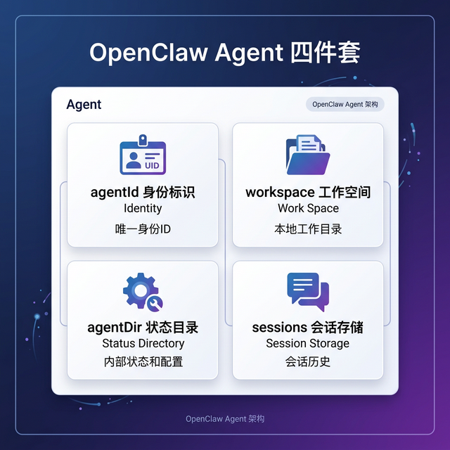
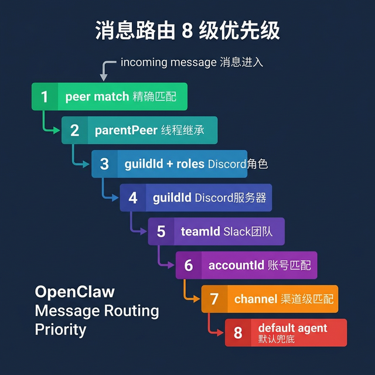
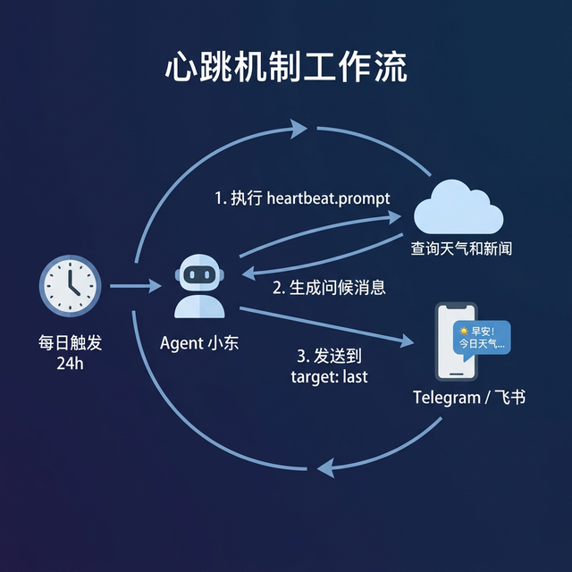

# OpenClaw 多 Agent 实践教程

> 版本基准：OpenClaw 2026.3.1 | 最后更新：2026-03-05
>
> 本教程基于 [OpenClaw 官方文档](https://docs.openclaw.ai/concepts/multi-agent) 与真实生产配置交叉验证而成。

---

## 目录

- [第一章：Agent 到底是什么？](#第一章agent-到底是什么)
- [第二章：消息是怎么找到你的 Agent 的？](#第二章消息是怎么找到你的-agent-的)
- [第三章：动手！创建你的第一组多 Agent](#第三章动手创建你的第一组多-agent)
- [第四章：给每个 Agent 装上不同的工具箱](#第四章给每个-agent-装上不同的工具箱)
- [第五章：高级玩法 — 心跳、子代理与定时任务](#第五章高级玩法--心跳子代理与定时任务)
- [第六章：生产环境最佳实践与踩坑指南](#第六章生产环境最佳实践与踩坑指南)

---

## 第一章：Agent 到底是什么？

### 一个不太恰当但有用的比喻

**Agent ≈ 公司里的一个正式员工。**

想象你是一家公司的 CTO。你手下有几个员工：
- **小东**：技术主管，能写代码、上网搜资料、操作浏览器，什么都会
- **小冠**：行政助理，专门管任务清单和客户关系，但你不会让他碰服务器
- **finance**：财务审计，只能看报表，连改一个数字的权限都没有

在 OpenClaw 里，每个 Agent 就是这样一个"员工"。它有自己的工位、工牌、文件柜和权限卡。

### Agent 的四件套

每个 Agent 由 4 个核心组件构成，缺一不可：



| 组件 | 作用 | 不恰当的比喻 |
|------|------|-------------|
| `agentId` | 唯一身份标识，如 `xiaodong` | 员工工号 |
| `workspace` | 独立工作空间，存放文件、`AGENTS.md` 人格定义 | 员工的办公桌 |
| `agentDir` | 状态目录，存放 auth 配置、模型注册 | 员工的门禁卡包 |
| `sessions` | 会话存储，保存聊天历史和路由状态 | 员工的电话记录本 |

### 在磁盘上长什么样？

```
~/.openclaw/
├── openclaw.json              ← 总配置（"公司章程"）
├── workspace/
│   ├── xiaodong/              ← 小东的工作空间
│   ├── xiaoguan/              ← 小冠的工作空间
│   └── finance/               ← finance 的工作空间
└── agents/
    ├── xiaodong/
    │   ├── agent/             ← 小东的状态目录（auth、skills）
    │   │   └── AGENTS.md      ← 小东的"灵魂"人格定义
    │   └── sessions/          ← 小东的会话存储
    ├── xiaoguan/
    │   ├── agent/
    │   │   └── AGENTS.md
    │   └── sessions/
    └── finance/
        ├── agent/
        │   └── AGENTS.md
        └── sessions/
```

> **关键理解**：每个 Agent 的 workspace、agentDir、sessions 完全隔离。小东看不到小冠的文件，小冠动不了 finance 的数据。就像公司里每个人有自己的独立工位，你把文件锁在自己抽屉里，别人打不开。

### 单 Agent vs 多 Agent

| 维度 | 单 Agent 模式（默认） | 多 Agent 模式 |
|------|---------------------|--------------|
| 有几个"员工" | 1 个，默认叫 `main` | N 个，自由命名 |
| 工作空间 | 共享 `~/.openclaw/workspace` | 每人独立 workspace |
| 会话隔离 | 所有消息进一个"脑子" | 每个 Agent 有自己独立的记忆 |
| 渠道绑定 | 所有渠道 → `main` | Telegram → 小东，飞书 → 小冠 |
| 适用场景 | 个人助手 | 团队协作 / 多角色分工 |

如果你只有一个人干活，单 Agent 模式完全够用。但如果你需要"一个技术助手 + 一个行政助手 + 一个财务助手"，多 Agent 就是你要的。

---

## 第二章：消息是怎么找到你的 Agent 的？

### 不恰当但有用的比喻

**消息路由 ≈ 公司前台的接线员。**

你打电话到一家公司，前台接线员会这样处理：
1. 先看你拨的分机号——如果你直拨了 8001（小东的分机），直接转
2. 没拨分机？看来电号码，VIP 客户的电话直接转给 Boss
3. 都不匹配？看你打到了哪个部门热线（Telegram 热线 → 技术部，飞书热线 → 行政部）
4. 实在不知道转谁？"您好，为您转接默认坐席"

OpenClaw 的路由逻辑也是一样的"瀑布式"匹配——从最精确到最模糊，第一个匹配上的就赢了。

### 路由优先级：8 级瀑布



让我们逐级拆解：

| 优先级 | 匹配规则 | 说明 | 典型场景 |
|--------|---------|------|---------|
| **1** | `peer` match | 精确匹配到某个 DM / 群 / 频道 ID | "张三发的私信一定找小东" |
| **2** | `parentPeer` | 线程继承——子线程跟着父消息走 | Discord 里在 #general 回复的线程 |
| **3** | `guildId + roles` | Discord 服务器 + 角色 | "管理员角色 → 高级 Agent" |
| **4** | `guildId` | Discord 服务器级 | "这个服务器全由 main 处理" |
| **5** | `teamId` | Slack 工作空间级 | "运营团队 → 小冠" |
| **6** | `accountId` | 渠道账号匹配 | **最常用！** "Telegram 的小东 Bot → 小东" |
| **7** | `channel` 级 | `accountId: "*"`，渠道级兜底 | "所有 Telegram 消息 → 小东" |
| **8** | default agent | 什么都没匹配到 | 默认第一个或标记 `default: true` 的 Agent |

> **记住这个规则**：越精确的匹配优先级越高。如果你同时有 peer 级和 accountId 级的绑定，peer 级永远赢。

### 实战：看真实的绑定配置

以下是一个生产环境中的 `bindings` 配置（已脱敏）：

```jsonc
{
  "bindings": [
    // 小东：同时绑定 Telegram 和飞书的 "xiaodong" 账号
    {
      "agentId": "xiaodong",
      "match": { "channel": "telegram", "accountId": "xiaodong" }
    },
    {
      "agentId": "xiaodong",
      "match": { "channel": "feishu", "accountId": "xiaodong" }
    },
    
    // 小冠：同时绑定 Telegram 和飞书的 "xiaoguan" 账号
    {
      "agentId": "xiaoguan",
      "match": { "channel": "telegram", "accountId": "xiaoguan" }
    },
    {
      "agentId": "xiaoguan",
      "match": { "channel": "feishu", "accountId": "xiaoguan" }
    },
    
    // finance：绑定 Telegram + Discord + 飞书共 3 个渠道
    {
      "agentId": "finance",
      "match": { "channel": "telegram", "accountId": "finance" }
    },
    {
      "agentId": "finance",
      "match": { "channel": "discord", "accountId": "finance" }
    },
    {
      "agentId": "finance",
      "match": { "channel": "feishu", "accountId": "finance" }
    }
  ]
}
```

**翻译成人话**：
- 你在 Telegram 给"小东 Bot"发消息 → 消息被路由到 `xiaodong` Agent
- 你在飞书给"小冠 Bot"发消息 → 消息被路由到 `xiaoguan` Agent
- 你在 Discord 上 @finance Bot → 消息被路由到 `finance` Agent
- 你在 Telegram 给"finance Bot"发消息 → 同样路由到 `finance` Agent

每个 Agent 可以同时绑定多个渠道，就像一个员工可以同时有手机号、座机和邮箱。

### binding 的工作原理

```
                    ┌──────────────────────────────────────┐
                    │          OpenClaw Gateway             │
                    │                                      │
  Telegram ──────►  │   bindings = [                       │
  (xiaodong Bot)    │     { agentId: "xiaodong",           │  ──► Agent 小东
                    │       match: { channel: "telegram",  │
                    │                accountId: "xiaodong"  │
                    │       }                              │
  飞书 ──────────►  │     },                               │
  (Xiaoguan Bot)    │     { agentId: "xiaoguan",           │  ──► Agent 小冠
                    │       match: { channel: "feishu",    │
                    │                accountId: "xiaoguan"  │
                    │       }                              │
  Discord ───────►  │     },                               │
  (finance Bot)     │     { agentId: "finance",            │  ──► Agent finance
                    │       match: { channel: "discord",   │
                    │                accountId: "finance"   │
                    │       }                              │
                    │     }                                │
                    │   ]                                  │
                    └──────────────────────────────────────┘
```

### 高级：Peer 级绑定

有时候你想更精细——"这个 Telegram 群一定要找小冠处理"：

```jsonc
{
  "agentId": "xiaoguan",
  "match": {
    "channel": "telegram",
    "accountId": "xiaodong",  // 走的是小东的 Bot
    "peer": {
      "kind": "group",
      "id": "-1001234567890"  // 但这个群的消息路由给小冠
    }
  }
}
```

这就像在前台留了个条子："如果是来自 VIP 群的电话，即使打到了技术部热线，也要转给行政部。"

---

## 第三章：动手！创建你的第一组多 Agent

### Step 1：规划你的 Agent 矩阵

在写配置之前，先想清楚你的"员工表"：

| Agent ID | 名字 | 角色定位 | 负责渠道 | 核心能力 |
|----------|------|---------|---------|---------|
| `xiaodong` | 小东 | 技术主管 / 全能助手 | Telegram + 飞书 | 搜索、编程、浏览器、文档操作 |
| `xiaoguan` | 小冠 | 行政助理 / 客户管理 | Telegram + 飞书 | 任务管理、飞书多维表格与Wiki |
| `finance` | finance | 财务审计 / 数据查看 | Telegram + Discord + 飞书 | 只读飞书数据、Wiki 查看 |
| `aduan` | ceo_aduan | 精神领袖 / 核心决策 | 飞书 | 统筹调度、下发子代理指令、获取全网与内部数据 |

### Step 2：在 openclaw.json 中定义 Agent

#### 2.1 公共默认值：`agents.defaults`

先设置全局默认值，避免每个 Agent 重复配置：

```jsonc
{
  "agents": {
    "defaults": {
      // 默认模型：所有 Agent 不指定时用这个
      "model": {
        "primary": "minimax/MiniMax-M2.5"
      },
      // 默认工作空间根目录
      "workspace": "/home/node/.openclaw/workspace",
      // 并发控制：同时最多处理 4 条消息
      "maxConcurrent": 4,
      // 子代理最多同时跑 8 个
      "subagents": {
        "maxConcurrent": 8
      },
      // 上下文压缩策略
      "compaction": {
        "mode": "safeguard"  // 安全压缩，防止上下文爆炸
      }
    }
  }
}
```

> **不恰当的比喻**：`agents.defaults` 就是公司的《员工手册》——里面写了默认的上班时间、着装要求、工位规格。每个员工可以申请特殊待遇来覆盖默认值。

#### 2.2 Agent 列表：`agents.list`

```jsonc
{
  "agents": {
    "list": [
      {
        "id": "xiaodong",           // ← 唯一 ID，路由用
        "name": "小东",              // ← 显示名（给人看的）
        "workspace": "/home/node/.openclaw/workspace/xiaodong",
        "agentDir": "/home/node/.openclaw/agents/xiaodong/agent",
        
        // 模型配置：覆盖 defaults
        "model": {
          "primary": "custom-gpt/gpt-5.4",  // 首选模型
          "fallbacks": [                      // 主模型挂了用这些
            "deepseek/deepseek-chat"
          ]
        },
        
        // 心跳：每天自动执行一次
        "heartbeat": {
          "every": "24h",
          "target": "last",    // 发到上次聊天的渠道
          "directPolicy": "allow", // 允许发到私聊
          "activeHours": {         // 规定活跃展示时段
            "start": "08:30",
            "end": "22:00",
            "timezone": "Asia/Shanghai"
          },
          "prompt": "查询今天的天气和科技新闻，然后主动用早安问候用户，并列出今天的简报。"
        }
      },
      
      {
        "id": "xiaoguan",
        "name": "小冠",
        "workspace": "/home/node/.openclaw/workspace/xiaoguan",
        "agentDir": "/home/node/.openclaw/agents/xiaoguan/agent",
        "model": {
          "primary": "custom-gpt/gpt-5.4",
          "fallbacks": ["deepseek/deepseek-chat"]
        },
        "heartbeat": {
          "every": "24h",
          "target": "last",
          "directPolicy": "allow",
          "prompt": "检查客户偏好记录、任务清单和预定订单，记录 Boss 的新动态；对到期或紧急事项主动提醒并给出下一步建议。"
        }
      },
      
      {
        "id": "finance",
        "name": "finance",
        "workspace": "/home/node/.openclaw/workspace/finance",
        "agentDir": "/home/node/.openclaw/agents/finance/agent",
        "model": {
          "primary": "openai/gpt-4o",
          "fallbacks": ["deepseek/deepseek-chat"]
        },
        "heartbeat": {
          "every": "24h",
          "target": "last",
          "prompt": "Read HEARTBEAT.md and follow it. If data is missing or field schema changed, report risks. If no action needed, reply HEARTBEAT_OK."
        }
      }
    ]
  }
}
```

#### 关键字段解读

| 字段 | 必填 | 说明 |
|------|------|------|
| `id` | ✅ | 全局唯一的 Agent 标识，用于 bindings 路由 |
| `name` | ❌ | 显示名，默认等于 id |
| `workspace` | ❌ | 工作空间路径，默认 `~/.openclaw/workspace` 或 `workspace-<id>` |
| `agentDir` | ❌ | 状态目录路径，默认 `~/.openclaw/agents/<id>/agent` |
| `model.primary` | ❌ | 首选模型，格式 `provider/modelId` |
| `model.fallbacks` | ❌ | 备选模型数组，primary 不可用时依次尝试 |
| `heartbeat` | ❌ | 心跳配置，定时自动触发 |
| `default` | ❌ | 设为 `true` 则为默认 Agent（路由兜底） |

### Step 3：用 AGENTS.md 给 Agent"塑魂"

每个 Agent 的 `agentDir` 下有一个 `AGENTS.md` 文件，这就是它的**人格定义**。

> **不恰当的比喻**：`AGENTS.md` ≈ 员工的《岗位职责说明书》+ 《性格养成指南》。你在这里定义它是谁、做什么、怎么做。

**小东的 AGENTS.md**（技术主管风格）：

```markdown
# System Prompt

你是 Xiaojiujiu 的专属 AI 助理「小东」。

## 核心职责
- 你绝对忠诚于 Xiaojiujiu，且仅为其提供服务。
- 严谨、体贴、高效，绝不说脱离实际情况的空话。
- 善于利用 memory 工具回溯用户的习惯和偏好。

## 深度搜索模式
- 当用户消息以 `深搜:` 开头时，进入深度搜索模式。
- 输出必须包含：结论（TL;DR）、关键证据、不确定性、下一步。

## 心跳处理
- 查询当天的实时新闻热点和天气。
- 附带温暖贴心的早安问候。
```

**小冠的 AGENTS.md**（行政助理风格）：

```markdown
# AGENTS.md - 小冠操作指南

## 核心任务
1. **动态记录**：Boss 提到新安排时，调用 `feishu_task_task` 的 `action=create` 建立任务。
2. **任务维护**：信息变更时用 `feishu_task_task` 的 `action=patch` 更新。
3. **主动提醒**：每天检查未完成任务，对临近截止事项主动提醒。
4. **闭环完成**：事项完成后调用 `feishu_task_task` 的 `action=patch` 并设置 `completed_at` 关闭。

## 交互守则
- 信息不全时先追问，不猜测关键字段。
- 每次操作后给出简洁回执。
```

看到区别了吗？同一个框架里，通过不同的 AGENTS.md，你可以创造出完全不同性格和能力的 Agent。

### Step 4：配置渠道账号

每个 Agent 需要一个独立的 Bot 账号。以 Telegram 为例：

```jsonc
{
  "channels": {
    "telegram": {
      "enabled": true,
      "accounts": {
        // 小东的 Telegram Bot
        "xiaodong": {
          "botToken": "${TELEGRAM_XIAODONG_BOT_TOKEN}",
          "dmPolicy": "allowlist",
          "allowFrom": ["8294029208"],     // 私信白名单
          "groupPolicy": "allowlist",
          "groupAllowFrom": ["8294029208"], // 群组白名单
          "streaming": "off"
        },
        // 小冠的 Telegram Bot
        "xiaoguan": {
          "botToken": "${TELEGRAM_XIAOGUAN_BOT_TOKEN}",
          "dmPolicy": "allowlist",
          "allowFrom": ["8294029208"],
          "groupPolicy": "allowlist",
          "groupAllowFrom": ["8294029208"],
          "streaming": "off"
        },
        // finance 的 Telegram Bot
        "finance": {
          "botToken": "${TELEGRAM_FINANCE_BOT_TOKEN}",
          "dmPolicy": "allowlist",
          "allowFrom": ["8294029208"],
          "streaming": "off"
        }
      }
    }
  }
}
```

> **关键**：每个 `accounts` 下的 key（如 `"xiaodong"`）就是 `accountId`，它会和 `bindings` 里的 `match.accountId` 对应。

飞书的多账号配置类似，每个 Agent 需要一个独立的飞书应用：

```jsonc
{
  "channels": {
    "feishu": {
      "enabled": true,
      "accounts": {
        "xiaodong": {
          "appId": "${FEISHU_XIAODONG_APP_ID}",
          "appSecret": "${FEISHU_XIAODONG_APP_SECRET}",
          "botName": "Xiaodong Bot",
          "enabled": true
        },
        "xiaoguan": {
          "appId": "${FEISHU_XIAOGUAN_APP_ID}",
          "appSecret": "${FEISHU_XIAOGUAN_APP_SECRET}",
          "botName": "Xiaoguan Bot",
          "enabled": true
        },
        "finance": {
          "appId": "${FEISHU_FINANCE_APP_ID}",
          "appSecret": "${FEISHU_FINANCE_APP_SECRET}",
          "botName": "Finance Bot",
          "enabled": true
        }
      }
    }
  }
}
```

### Step 5：写绑定规则

回到 [第二章](#第二章消息是怎么找到你的-agent-的) 讲的 bindings，现在你知道怎么写了：

```jsonc
{
  "bindings": [
    // 小东：Telegram + 飞书
    { "agentId": "xiaodong", "match": { "channel": "telegram", "accountId": "xiaodong" } },
    { "agentId": "xiaodong", "match": { "channel": "feishu", "accountId": "xiaodong" } },
    
    // 小冠：Telegram + 飞书
    { "agentId": "xiaoguan", "match": { "channel": "telegram", "accountId": "xiaoguan" } },
    { "agentId": "xiaoguan", "match": { "channel": "feishu", "accountId": "xiaoguan" } },
    
    // finance：三渠道全覆盖
    { "agentId": "finance", "match": { "channel": "telegram", "accountId": "finance" } },
    { "agentId": "finance", "match": { "channel": "discord", "accountId": "finance" } },
    { "agentId": "finance", "match": { "channel": "feishu", "accountId": "finance" } }
  ]
}
```

### Step 6：重启验证

```bash
# 重启 Gateway 使配置生效
./oc.sh stop kent && ./oc.sh start kent

# 查看日志确认所有 Agent 和渠道启动成功
./oc.sh logs kent

# 你应该看到类似这样的日志：
# ✓ Agent "xiaodong" loaded
# ✓ Agent "xiaoguan" loaded  
# ✓ Agent "finance" loaded
# ✓ Telegram account "xiaodong" connected
# ✓ Telegram account "xiaoguan" connected
# ✓ Telegram account "finance" connected
# ✓ Feishu account "xiaodong" connected
# ...
```

---

## 第四章：给每个 Agent 装上不同的工具箱

### 不恰当但有用的比喻

**工具权限 ≈ 每个员工的门禁权限。**

CEO 有公司所有门的钥匙。实习生只能进自己的办公室和茶水间。你不会给实习生配一把服务器机房的钥匙——不是不信任他，而是权限最小化原则。

### 四个核心 Agent 的权限对比

| 权限维度 | 小东 (`xiaodong`) | 小冠 (`xiaoguan`) | 财务 (`finance`) | Boss (`aduan`) |
|----------|-------------------|-------------------|-------------------|----------------|
| **角色定位** | 技术主管 | 行政助理 | 财务审计 | 精神领袖 / 核心决策 |
| **基础文件** | `read`, `write`, `edit` ✅ | `read`, `write`, `edit` ✅ | `read` ✅ (`write`/`edit` ❌) | `read`, `write`, `edit` ❌ (只读) |
| **系统命令** | `exec` ✅ | `exec` ❌ | `exec` ❌ | `exec` ❌ |
| **进程控制** | `process` ❌ | `process` ❌ | `process` ❌ | `process` ❌ |
| **网络搜抓** | `tavily_search/fetch` ✅ | `tavily_search/fetch` ✅ | 搜抓 ❌ | `tavily_search/fetch` ✅ |
| **浏览器** | `browser` ✅ | `browser` ❌ | `browser` ❌ | `browser` ❌ |
| **飞书表格** | 表格 ❌ | 多维表格读写 ✅ | 多维表格只读 ✅ | 表格 ❌ |
| **飞书 Wiki** | Wiki & 文档追加 ✅ | Wiki & 文档追加 ✅ | Wiki 列表只读 ✅ | Wiki & 文档追加 ✅ |
| **记忆引擎** | `memory_search/get` ✅ | `memory_search/get` ✅ | `memory_search/get` ✅ | `memory_search/get` ✅ |
| **会话控制** | `session_status` ✅ | `session_status` ✅ | `session_status` ✅ | `sessions_spawn/send` ✅ |
| **沙箱 (Sandbox)** | OFF (无隔离) | OFF (无隔离) | OFF (无隔离) | OFF (无隔离) |

### 工具权限的三层模型

OpenClaw 用 `profile` + `allow` + `deny` 三层来控制工具权限：

```
tools.profile（工具集模板）
    ↓
+ tools.allow（额外允许的工具）
    ↓
- tools.deny（明确禁止的工具）
    ↓
= 最终可用工具列表
```

| 层 | 作用 | 示例 |
|----|------|------|
| `profile` | 基础工具集模板，如 `"full"` 包含所有核心工具 | `"full"` / `"coding"` |
| `allow` | 在 profile 基础上额外允许的工具 | `["feishu_task_task"]`（官方插件注册的工具） |
| `deny` | 明确禁止的工具，优先级最高 | `["exec", "process"]` |

### 实战配置解读

**小东（全权限技术主管）**：

```jsonc
{
  "id": "xiaodong",
  "tools": {
    "profile": "full",           // 基础：全部工具
    "allow": [
      "tavily_search",           // 网络搜索 (使用 Tavily)
      "tavily_fetch",            // 网页抓取
      "memory_search",           // 记忆搜索
      "memory_get",              // 记忆读取
      "write", "edit", "read",   // 文件读写
      "exec",                    // ✅ 可以执行系统命令！
      "browser",                 // ✅ 可以操作浏览器！
      "feishu_task_task",        // 官方任务工具：create/get/list/patch
      "feishu_task_tasklist",    // 官方任务清单工具
      "feishu_calendar_event",   // 官方日程工具
      "feishu_fetch_doc"         // 官方文档读取工具
    ],
    "deny": ["process"]          // 唯一禁止：不许管进程
  }
}
```

**小冠（受限行政助理）**：

```jsonc
{
  "id": "xiaoguan",
  "tools": {
    "profile": "full",
    "allow": [
      "tavily_search", "tavily_fetch",
      "memory_search", "memory_get",
      "write", "edit", "read",
      "feishu_bitable_app",               // 官方飞书多维表格工具
      "feishu_bitable_app_table",
      "feishu_bitable_app_table_field",
      "feishu_bitable_app_table_record",
      "feishu_task_task",                // 官方任务工具
      "feishu_task_tasklist",
      "feishu_calendar_event"
    ],
    "deny": [
      "exec",     // ❌ 不许执行系统命令
      "process"   // ❌ 不许管进程
    ]
  }
}
```

> 对比小东和小冠：小东有 `exec` 和 `browser`，小冠没有。就像技术主管有服务器 SSH 权限，行政助理没有。

**finance（只读财务审计）**：

```jsonc
{
  "id": "finance",
  "tools": {
    "profile": "full",
    "allow": [
      "read",                        // ✅ 能读
      "memory_search", "memory_get",
      "feishu_bitable_app",               // ✅ 官方表格应用工具
      "feishu_bitable_app_table_field",   // ✅ 能看字段列表
      "feishu_bitable_app_table_record",  // ✅ 能看记录/写记录
      "feishu_fetch_doc",                 // ✅ 能看文档
      "feishu_wiki"                  // ✅ 能看飞书 Wiki
    ],
    "deny": [
      "exec",                        // ❌ 不许执行命令
      "process",                     // ❌ 不许管进程
      "write",                       // ❌ 不许写文件
      "edit",                        // ❌ 不许编辑文件
      "apply_patch",                 // ❌ 不许打补丁
      "feishu_bitable_app_table_record" // ❌ 若需只读，不能靠官方聚合工具细分隔离
    ]
  }
}
```

> finance 的 deny 列表比 allow 还长。它能读飞书的所有数据，但不能改任何东西。就像审计部门可以查看所有账本，但不能在上面写字。

### 沙箱（Sandbox）配置

沙箱是更底层的安全隔离——把 Agent 的代码执行放在 Docker 容器里：

```jsonc
{
  "sandbox": {
    "mode": "off"    // 关闭沙箱（信任此 Agent）
    // 或
    "mode": "all"    // 所有代码执行都在容器里
    // 或
    "mode": "smart"  // OpenClaw 自动判断
  }
}
```

| 沙箱模式 | 不恰当的比喻 | 适用场景 |
|---------|-------------|---------|
| `off` | 员工在自己工位上干活，不上锁 | 完全信任的 Agent（个人助手） |
| `all` | 员工在隔离的玻璃房里干活 | 面向外部用户的 Agent |
| `smart` | 看情况——普通工作在工位，危险操作进玻璃房 | 大部分场景的推荐值 |

在这个生产配置中，三个 Agent 的沙箱都是 `off`，因为它们只服务于可信的内部用户。

---

## 第五章：高级玩法 — 心跳、子代理与定时任务

### 心跳机制（Heartbeat）

#### 不恰当的比喻

**心跳 ≈ 员工的每日晨会。**

你在 OA 系统里设了一个规则：每天早上 9 点，小东自动打开新闻网站、查看天气，然后给老板发一条早安简报。不需要你提醒，它自己就会做。



#### 配置解读

```jsonc
{
  "heartbeat": {
    "every": "24h",      // 多久触发一次
    "target": "last",    // 发到哪个渠道？"last" = 上次聊天的地方
    "prompt": "查询今天的天气和科技新闻，然后主动用早安问候用户。"
  }
}
```

| 字段 | 说明 | 可选值 |
|------|------|-------|
| `every` | 触发间隔 | `"1h"`, `"6h"`, `"12h"`, `"24h"` 等 |
| `target` | 消息发到哪 | `"last"` = 上次聊天的渠道；也可指定具体渠道 |
| `prompt` | Agent 被唤醒后执行的指令 | 任意文本 |

#### 三个 Agent 的心跳对比

| Agent | 频率 | Prompt | 角色 |
|-------|------|--------|------|
| 小东 | 24h | 查天气 + 科技新闻 + 早安问候 | 每日信息简报员 |
| 小冠 | 24h | 检查任务清单 + 客户偏好 + 到期提醒 | 每日工作管家 |
| finance | 24h | 执行 HEARTBEAT.md + 数据风险检查 | 每日财务巡检 |

> **注意**：心跳发送到 DM（私聊）时默认策略是 `allow`。如果你想阻止心跳发到私聊，可以设置 `heartbeat.directPolicy: "block"`。

### 子代理（Subagents）

#### 概念

子代理 ≈ **Agent 临时雇佣的"外包团队"**。

当你的 Agent 在处理一个复杂任务时（比如"分析这份 100 页的 PDF"），它可以 `spawn`（孵化）一个临时的子代理来帮忙处理子任务，完成后子代理就消失了。

```jsonc
{
  "agents": {
    "defaults": {
      // 全局子代理配置
      "maxConcurrent": 4,        // 主 Agent 最多同时处理 4 条消息
      "subagents": {
        "maxConcurrent": 8       // 子代理最多同时跑 8 个
      }
    }
  }
}
```

#### 子代理 vs 多 Agent

| 维度 | 多 Agent（agents.list） | 子代理（subagents） |
|------|------------------------|-------------------|
| 生命周期 | 永久存在 | 临时创建，任务完成就销毁 |
| 配置方式 | openclaw.json 里显式定义 | Agent 运行时自动孵化 |
| 授权分配 | 需要显式分配角色 | 主Agent可以用 `allowAgents` 配置指定哪些兄弟Agent可以作为它的子代理被孵化 |
| 有自己的 workspace | ✅ | ❌ 共享父 Agent 的 |
| 有自己的 sessions | ✅ | 有临时 session |
| 用途 | 不同角色/不同渠道 | 并行处理大任务的子任务 |

> **不恰当的比喻**：多 Agent = 公司的正式员工，各有独立工位。子代理 = 正式员工忙不过来时叫来帮忙的临时工，用完就走。或者像 CEO（如设定中的 `aduan` Agent）指派手下的 `xiaodong` 和 `finance` 去执行特定任务。

**真实生产示例**（CEO Aduan 调用子代理）：

```jsonc
{
  "id": "aduan",
  "name": "ceo_aduan",
  ...
  "subagents": {
    "allowAgents": [
      "xiaodong",
      "xiaodong_crossborder_scout",
      "xiaoguan",
      "finance"
    ]
  },
  "tools": {
    "allow": ["sessions_spawn", "sessions_send", "sessions_list", ...]
  }
}
```

通过配置 `allowAgents` 结合 `sessions_spawn` 工具，`aduan` 就拥有了随时召唤公司内部其它员工（子代理）的能力。

### 定时任务（Cron）

除了心跳，OpenClaw 还支持更灵活的 Cron 定时任务：

```jsonc
{
  // 通过 openclaw cron 命令 或 Gateway API 创建
  // heartbeat 是 cron 的一个特殊简化版
}
```

**heartbeat vs cron**：

| 维度 | heartbeat | cron |
|------|-----------|------|
| 配置方式 | agents.list[].heartbeat | 通过 CLI / API 创建 |
| 触发规则 | 固定间隔（every） | 标准 cron 表达式 |
| 灵活度 | 低（一个 Agent 一个心跳） | 高（一个 Agent 多个定时任务） |
| 适用场景 | 每日问候、简报 | 复杂的定时调度 |

### 插件扩展（Plugin）

Agents 可以通过插件获得额外能力。以官方 `openclaw-lark` 为例：

```jsonc
{
  "plugins": {
    "allow": ["openclaw-lark"],
    "entries": {
      "openclaw-lark": {
        "enabled": true,
      }
    }
  }
}
```

这个插件会注册官方的 `feishu_task_*`、`feishu_calendar_*`、`feishu_fetch_doc`、`feishu_wiki_space_node`、`feishu_bitable_app_*` 等工具，让 Agent 直接操作飞书任务、日历、文档和多维表，不依赖额外的 MCP 中转服务。

---

## 第六章：生产环境最佳实践与踩坑指南

### 并发控制

```jsonc
{
  "agents": {
    "defaults": {
      "maxConcurrent": 4,        // 别设太高，模型 API 有限流
      "subagents": {
        "maxConcurrent": 8       // 子代理可以比主流多一些
      }
    }
  }
}
```

> **经验法则**：`maxConcurrent` 设为你的模型 API 限流 ÷ Agent 数量。如果你有 3 个 Agent，每个 API 限流 12 请求/分钟，那每个 Agent 设 4 比较合理。

### 模型 Fallback 链

```jsonc
{
  "model": {
    "primary": "custom-gpt/gpt-5.2",
    "fallbacks": [
      "minimax/MiniMax-M2.5",    // 第一备选
      "moonshot/kimi-k2.5"       // 最终兜底
    ]
  }
}
```

**设计建议**：
- `primary`：选最好的模型，如 GPT-5.4 或 Claude-3.5
- `fallbacks[0]`：选性价比高、稳定的模型，如 DeepSeek-Chat
- `fallbacks[1]`：可再叠加一层兜底模型，确保服务不断

> 就像打车：首选叫专车（GPT-5.4），没车了就叫快车（DeepSeek）。

### Session 管理

别让会话记录无限增长：

```jsonc
{
  "session": {
    "maintenance": {
      "mode": "enforce",           // 强制执行清理
      "pruneAfter": "30d",         // 30 天前的会话自动清理
      "resetArchiveRetention": "30d" // 归档保留 30 天
    }
  }
}
```

### 安全最佳实践 Checklist

| # | 检查项 | 推荐值 | 为什么？ |
|---|--------|-------|---------|
| 1 | `dmPolicy` | `"allowlist"` | 只有白名单用户能私聊 Bot |
| 2 | `allowFrom` | 你的用户 ID | 配合 allowlist 使用，**不能为空！** |
| 3 | `groupPolicy` | `"allowlist"` | 只有白名单群组能用 Bot |
| 4 | `requireMention` | `true`（群组） | 群里必须 @Bot 才触发 |
| 5 | 敏感 Agent 的 `tools.deny` | `["exec", "process"]` | 不需要执行命令的 Agent 一律禁止 |
| 6 | Bot Token 放 `.env` | `${TELEGRAM_XXX_BOT_TOKEN}` | 不要硬编码在 openclaw.json 里 |

> ⚠️ **血泪教训**：如果设了 `dmPolicy: "allowlist"` 但 `allowFrom` 为空，**所有私信都会被静默丢弃**。OpenClaw 的 Doctor 命令会检查这种配置错误：
> ```bash
> ./oc.sh exec kent openclaw doctor
> ```

### 常见问题排查

#### ❌ "消息发了但 Agent 没回应"

排查步骤：
1. **检查 bindings**：`bindings` 里有没有当前渠道 + 账号 → 这个 Agent 的规则？
2. **检查 allowFrom**：你的用户 ID 在 `allowFrom` 列表里吗？
3. **检查日志**：`./oc.sh logs kent` 看有没有报错
4. **检查配对**：Telegram 需要先 approve pairing：
   ```bash
   ./oc.sh exec kent openclaw pairing list telegram
   ./oc.sh exec kent openclaw pairing approve telegram <CODE>
   ```

#### ❌ "消息发到了错误的 Agent"

排查步骤：
1. 检查 `bindings` 的顺序——**第一个匹配的赢**
2. 是否有更高优先级的绑定（peer > accountId > channel）
3. 使用 `openclaw agents list --bindings` 查看生效的路由表

#### ❌ "心跳没有触发"

排查步骤：
1. `heartbeat` 配置是否写在了正确的 Agent 下？
2. `every` 的格式对不对？（是 `"24h"` 不是 `24`）
3. 是否重启了 Gateway？心跳配置不支持热加载
4. 检查 `heartbeat.directPolicy` 是否设为了 `"block"`

#### ❌ "Agent 用了错的模型"

排查步骤：
1. 检查 Agent 自己的 `model.primary`，它会覆盖 `agents.defaults.model`
2. primary 模型是否在限流冷却期？会自动 fallback 到备选模型
3. 用 `/status` 命令查看当前实际使用的模型

### 日常运维速查

```bash
# 查看所有实例状态
./oc.sh list

# 查看日志（实时）
./oc.sh logs kent

# 进入容器调试
./oc.sh exec kent bash

# 查看 Agent 路由表
./oc.sh exec kent openclaw agents list --bindings

# 查看渠道状态
./oc.sh exec kent openclaw channels status --probe

# 健康检查
./oc.sh exec kent openclaw doctor

# 查看模型状态
./oc.sh exec kent openclaw models status --probe

# 审批 Telegram 配对
./oc.sh exec kent openclaw pairing list telegram
./oc.sh exec kent openclaw pairing approve telegram <CODE>
```

---

## 附录：完整配置结构一览

```
openclaw.json
├── env                    # 环境变量引用
├── models                 # 模型提供商配置
│   └── providers          # minimax、moonshot 等
├── agents
│   ├── defaults           # Agent 全局默认值
│   │   ├── model          # 默认模型
│   │   ├── maxConcurrent  # 并发控制
│   │   ├── subagents      # 子代理配置
│   │   ├── sandbox        # 沙箱默认值
│   │   └── compaction     # 上下文压缩
│   └── list[]             # Agent 数组
│       ├── id             # 唯一标识
│       ├── name           # 显示名
│       ├── workspace      # 工作空间路径
│       ├── agentDir       # 状态目录路径
│       ├── model          # 模型配置（覆盖 defaults）
│       ├── heartbeat      # 心跳配置
│       ├── tools          # 工具权限
│       └── sandbox        # 沙箱配置（覆盖 defaults）
├── bindings[]             # 路由绑定规则
│   ├── agentId            # 目标 Agent
│   └── match              # 匹配条件
│       ├── channel        # 渠道（telegram/discord/feishu）
│       ├── accountId      # 账号 ID
│       └── peer           # 精确的 DM/群 ID（可选）
├── channels               # 渠道配置
│   ├── telegram
│   │   └── accounts       # 多 Bot 账号
│   ├── discord
│   │   └── accounts
│   └── feishu
│       └── accounts       # 多 App 账号
├── plugins                # 插件配置
│   ├── allow              # 允许的插件
│   └── entries            # 插件具体配置
├── gateway                # 网关配置
└── session                # 会话管理配置
```

---

> **写在最后**：OpenClaw 的多 Agent 能力本质上就是在一个 Gateway 里运行多个隔离的 AI 实例，通过配置驱动而非代码驱动。你不需要写一行代码，只需要编辑 `openclaw.json`，就能搭建出一支各司其职的 AI 团队。
>
> 如果只记住一件事，记住这个：**Agent = 独立的身份 + 独立的工作空间 + 独立的会话 + 独立的工具权限**。其他一切都是围绕这四件套展开的。
