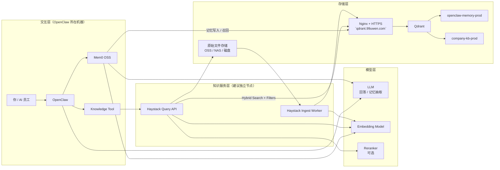
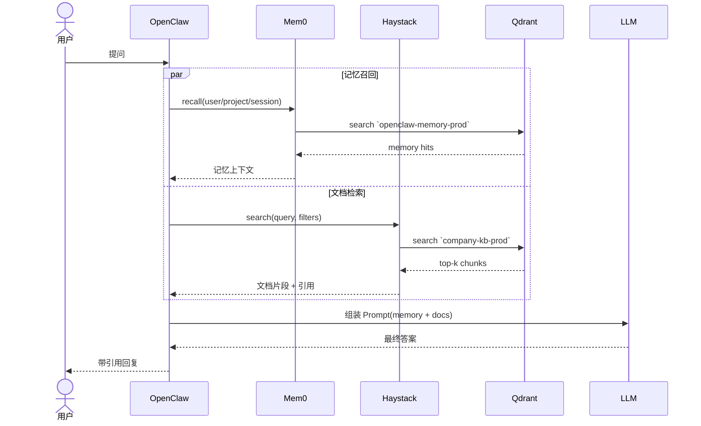

# OpenClaw 知识与记忆架构规划设计（Haystack + Qdrant + OpenClaw + Mem0）

## 1. 架构定位

- **OpenClaw**：系统唯一的主入口，负责直接与用户交互、调度大模型并整合最终回复。不再引入第二个聊天平台。
- **Mem0 OSS**：专注长期记忆管理（如用户偏好、项目背景、历史决策、AI 员工共享约定），不承担长文档检索和解析功能。
- **Haystack**：专注企业知识库（文档入库、切块、检索、过滤、引用返回）。
- **Qdrant**：纯粹的向量索引层，集中管理所有的向量数据资产。

## 2. 系统架构图

## 3. 核心交互链路

## 4. 架构拍板点与核心原则 (含业界最新实践)

1. **统一入口**：OpenClaw 是唯一主入口，绝对不再引入第二个聊天交互平台。
2. **职能清晰边界**：
   - **Mem0**：只负责构建和维护“长期记忆”。
   - **Haystack**：只负责构建和查询“知识库”。
3. **单一向量引擎**：Qdrant 仅承担索引层职责，维护单一实例即可保障高可用，物理数据侧必须通过 Collection 分开。
4. **混合检索 (Hybrid Search) 标准**：知识库 (Haystack) 强烈建议结合 Dense Embeddings (语义理解) 与 Sparse Embeddings (词汇精确匹配如 BM25)。这在查询特定项目代号、内部专有名词时至关重要。
5. **基于元数据的权限与多租户控制**：
   - 知识库必须严格通过 Haystack 依赖 Payload Filters 完成可见性控制（使用 `department`, `project_id`, `access_level` 等元数据索引）。
   - 用户长期记忆 (Mem0) 也必须在 Qdrant 统一集合内建立 `user_id` 和 `session_id` 的 Payload 索引进行底层的数据物理隔离，而非按用户新建大量集合。
6. **轻量级向量存储**：原始的 PDF/图片/视频/Word 等均不进入 Qdrant。Qdrant 之中仅存放它们的物理路径或访问 URL、片段摘要 (chunks) 及相关元数据 (metadata)。
7. **异步更新记忆链路**：Mem0 入库阶段的 Update 环节属于计算密集型的调用（需 LLM 决策加入/修改/删除）。建议：用户请求的记忆**召回 (Recall)** 放主链路，但该回合之后的记忆**抽取和沉淀 (Extraction & Update)** 改为后台队列/异步操作，以免拖累最终用户的聊天响应速度。

## 5. Qdrant 集合 (Collection) 规划与索引策略

所有向量数据统一存储，通过不同集合实现业务隔离，并明确索引优化：

- **`openclaw-memory-prod`**：被 Mem0 独占，用于存取各类长期记忆与偏好。
  - **索引要求**：强烈建议对此集合的 `user_id` 和 `session_id` 建立 Payload Index 索引，保证亿级记忆下的秒级查询点。
- **`company-kb-prod`**：被 Haystack 独占，用于存取企业知识库所处理过的各类文档高维特征、分块及元数据。
  - **索引要求**：强烈建议对 `department` 和 `access_level` 建立 Payload Index，确保 Haystack 能够在检索前进行极其高效的安全前置筛选 (Pre-filtering)。
- **`company-kb-dev`**（可选）：供开发/测试阶段使用，避免脏数据污染生产知识库。

## 6. 部署节点拓扑建议

为避免解析大型文档导致的资源抖动影响对话机器人实时响应性，建议三端分离部署：

| 节点 / 服务器 | 承载组件 / 服务 | 部署说明 |
| :--- | :--- | :--- |
| **基础数据节点** (当前服务器) | Qdrant + Nginx (HTTPS) | 继续复用现有的 `https://qdrant.99uwen.com` 作为独立的数据底座。 |
| **知识服务节点** (新独立节点) | Haystack Query API Haystack Ingest Worker | 处理所有 CPU/内存 密集型任务，如 PDF 提取、切块构建、重排等，保证检索与入库效率。 |
| **交互逻辑节点** (OpenClaw 机器) | OpenClaw 核心服务 Mem0 OSS 插件 | 高效调度，只跑对话系统、编排 Prompt 和 Mem0 插件。坚决不碰知识库入库任务，保证系统低延迟。 |
